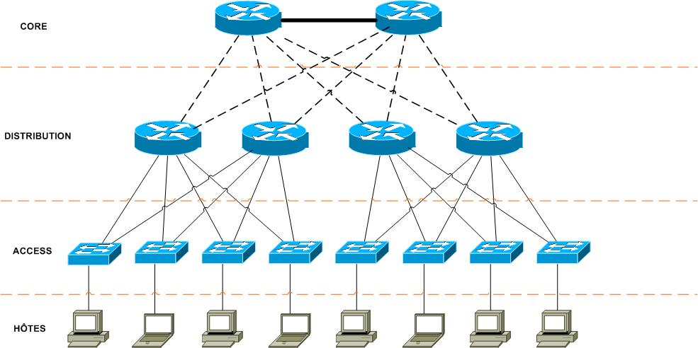
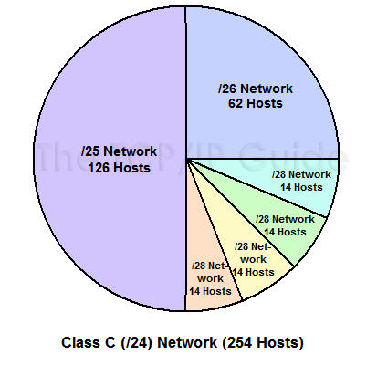

# Architecture LAN

## Mots clés :

- Commutateur
- Domaine de diffusion
- Réseau local
- Architecture en 3 couches
- Trafic inutile
- Données liées à l'administration
- Données en clair
- Plage IP
- Adresse d'administration
- Traitement heuristique

## Contexte :

Quoi ?

- Architecture LAN
- Administration des commutateurs

Comment ?

- En analysant le trafic du réseau
- Faire des maquettes
- Reconfigurant les switches
- Découper les plages IP

Pourquoi ?

- Diffusion trop importante des trames
- Les données passent en clair
- Même plage IP

## Problématique :

- Comment réduire le trafic sur un réseau LAN ?

- Comment découper une LAN et traité les données de manière sécurisée ?

Généralisation :

- Reconception

## Hypothèse :

- Créer des sous-réseaux
- Réaliser un schéma d'adressage
- Analyser le trafic
- Reconfigurer les switches
- Tempête de broadcast
- Redondance
- Créer des groupes de diffusions

## Plan d'action :

## Etudes :

### Domaine de diffusion, domaine de collision

Domaine de diffusion : ensemble de périphérique recevant les même annonces de diffusion (même sous-réseau) les données de broadcast se propagent par les hubs les bridges ou les switches (mais pas les routeurs) 
Un hub ne lit pas le nivea 2 et transmet donc la donnée sur tous les ports
Un bridge lit le niveau 2 et comprends qu'il s'agit d'un broadcast ( @MAC fff.fff.fff) et transmet la donnée sur son second port
Un switch lit le niveau 2 et comprends qu'il s'agit d'un broadcast ( @MAC fff.fff.fff) et transmet la donnée sur tous ses ports

Problème de domaines de diffusion trop grands: chaque périphérique accepte et traite tous les paquets de diffusion, solution : découper le réseau en sous-réseaux

Domaine de collision : ensemble d'entités qui partagent le même média de communication, si plusieurs entités envoient des données en même temps elles sont incompréhensibles (corrompues) 

### Séparer les sous-réseaux sans VLSM
### Architecture 3 couches

Modèle hiérarchique en 3 couches, "tree-layers hierarchical internetworking design/model"

Comme le nom l'indique on découpe le réseau en 3 couches, chacune ayant un rôle précis impliquant des différences de matériel, performances et outils

Les trois couches sont : 

- le couche coeur (core layer)
- la couche distribution (distribution layer)
- la couche accès (access layer)

##### **Core layer :**
Elle relie entre eux les différents segments du réseau (sites distants, LANs, étages de la société), il s'agit du backbone

C'est à ce niveau qu'on trouve les routeurs, puisque le trafic est très important à ce niveau les routers et switches doivent être performants.

##### **Distribution layer :**

Elle filtre, route et autorise ou non les paquets. On divise le réseau en segments et ajoutant plusiers routeurs/switches de distribution et on connecte chacun au core d'un côté et à la couche Access de l'autre

Si notre couche n'est composé que de switches le routage, la délimitation de domaines de broadcast et l'assurance de la tolérance aux pannes se fera sur la couche Core

##### **Access layer**

Son rôle est simple: connecter les les end-users au réseau et assurer la sécurité

Aucun routeur n'est présent, uniquement des switches ou parfois des hubs. La sécurisation se faire en utilisant **switchport** sur les switches en désactivant les interfaces non utilisées, etc
Les switch n'ont pas besoin de performances particulières, il auront aux max le nombre d'users égal à leur nb de port (1 ou 2 pour la liaison Access-Distribution) et les traitements sont basiques

Ce modèle bien que complexe est efficace et rentable, c'est donc pourquoi il est très utilisé

### VLSM

Avec la méthode classique de segmentation en sous-réseaux (A, B, C, D), le même nombre d'adresses est attribué à chaque sous-réseau. Cette répartition résulte très souvent en un gaspille d'adresses, c'est pourquoi on à recourt au VLSM

Avec le VLSM (Variable Length Subnet Mask) on peut découper un réseaux en sous réseaux de tailles différentes afin de correspondre au mieux au nombre de postes nécessaires 

Pour découper un réseaux à l'aide du VLSM on commence avec le plus grand sous réseaux et on découpe le réseau pour répondre au nombre de postes nécessaires ((2^nb de bits partie hôte)-2) plus une éventuelle marge (penser à l'évolutivité) on découpe ensuite les sous-réseaux restants pour satisfaire tous les sous-réseaux jusqu'au plus petit. Pour utiliser le VLSM on doit donc savoir le nombre de sous réseaux et la taille de chaque sous réseaux

### Configurer les switches de façon sécurisée (VTP, port)

VTP: 
permet de config les VLAN de tous les switches à partir d'un switch (création, suppression, modification)

Il s'agit d'un protocole propriétaire Cisco de niveau 2.
Fonctionnement : Les messages VTP diffuse des annonces de création, de suppression ou de modification de VLAN.  Cette diffusion s'effectue à travers tous les switch grâce à un trame de niveau 2 avec une @ de destionation MAC multicast particulière 01-00-0C-CC-CC-CC

architecture VTP:

VTP possède 3 modes VTP : client, transparent ou serveur:

VTP serveur : switch qui créer les annonces VTP (actif par défaut)

Il permet à l'admin de faire toute modification sur les VLANs et de propager automatiquement ses modifications vers tous les switches du réseau.

VTP client : switch qui reçoit, se synchronise et propage les annonces VTP

Ne permet pas à l'admin de faire des modifs sur les VLANs, il retourne un message d'erreur si on essaye 

VTP transparent : switch qui ne traite pas les annonces VTP

permet à l'admin de faire toute modif sur les VLANs en local uniquement (utile pour les maquettes)

synchronisation:
à chaque créa/suppr/modif de VLAN une variable RN (Revision number) s'incrémente (le switch seveur envoie une message VTP avec la nouvelle valeur RN, les autres switches compare le RN avec le RN d'ils stockent et si le leur est plus petit ils se synchronisent avec le Server et récup la nouvelle BDD. Par défaut le RN est envoyé automatiquement dès une créa/suppr/modif de VLAN puis toutes les 5 min

### VLAN

Permet de séparer des sous-réseaux en restant sur un même switch il est impossible pour des hôte d'un VLAN de communiquer avec ceux d'un autre VLAN

Configurer un VLAN, il existe principalement 3 façons :

- La plus utilisée : On créé le VLAN sur le switch puis on attribue le VLAN sur les ports souhaités 
- Beaucoup moins utilisé : On configure le switch pour récupérer l'@MAC qu'il voit transiter sur le port et envoie cette @MAC vers un serveur VWMP (VLAN Membership Policy Server) qui fait le lien entre l'@MAC et et le VLAN attribué via une BDD, le serveur VMPS indique au switch quel VLAN il faut attribuer au port. Pb : si le serveur tombe en panne le réseau l'est également
- Très utilisé pour téléphonie sur IP : On utilise la 1ere methode pour attribuer le VLAN au PC et pour le téléphone sur IP on utilise le protocole CDP (Cisco Discovery Protocol ) pour attribuer le VLAN voix uniquement

Note : 
- le nb de VLAN dépends du type de switch (64,128,1024,4096)
- le VLAN 1 est créé par défaut et tous les ports y appartiennent
- Il faut créé l'identifiant du VLAN avant de lui attribuer des ports
- On peut donner un nom à un VLAN

Certains VLAN sont réservés et d'autres créés par défaut 

##### **Config d'un  VLAN sur un switch :** 

On créé un VLAN et on le nomme :

	SwitchX# configure terminal
	SwitchX(config)# vlan 2
	SwitchX(config-vlan)# name [nom]
	SwitchX(config-vlan)#end

Attribuer un port à un VLAN

On identifie le port qui doit être dans le VLAN et on le configure sur le VLAN

	SwitchX# configure terminal
	SwitchX(config)# interface fastethernet 0/1
	SwitchX(config-if)# switchport access vlan 2 
	SwitchX(config-if)# end

On peut configurer plusieurs ports à la fois sur un VLAN

	SwitchX# configure terminal
	SwitchX(config)# interface range fastethernet 0/2 - 7
	SwitchX(config-if)# switchport access vlan 2 
	SwitchX(config-if)# end

Note : le port ne sera dans le VLAN que si il est en mode access, on peut savoir si un port est en access ou en trunk avec la commande :

	show interfaces fa0/2 switchport Name: Fa0/2

On peut voir les VLAN configurés avec :

	SwitchX#show vlan

Config les interconnexions :
	
	Switch>enable
	Switch#configure terminal
	Switch(config)#interface {type d'interface} [numéro d'interface]
	Switch(config-if)#switchport mode trunk
	Switch(config-if)#end

Config les serveurs VTP :

	Switch>enable
	Switch#configure terminal
	Switch(config)#vtp domain [domaine]
	Switch(config)#vtp password [password]
	Switch(config)#vtp version 2
	Switch(config)#vtp mode server

Config client VTP :

	Switch>enable
	Switch#configure terminal
	Switch(config)#vtp domain webtutos.fr
	Switch(config)#vtp password webtutos
	Switch(config)#vtp version 2
	Switch(config)#vtp mode client

Config un VTP transparent : 

	Switch>enable
	Switch#configure terminal
	Switch(config)#vtp domain webtutos.fr
	Switch(config)#vtp password webtutos
	Switch(config)#vtp version 2
	Switch(config)#vtp mode transparent

Consulter la bdd :

	Switch#show interfaces trunk
	Switch#show vtp status
	Switch#show vlan

### Sécuriser les switches

on peut limiter l'accès à certaines adresses MAC à l'aide de Port-security

Il y a 2 méthodes :

enregistrer manuellement les adresse MAC autorisées
prendre comme adresse autorisée celle de l'hôte qui se connecte et envoie une trame en premier sur le port

on peut voir où la protection est activée avec 

	show port-security

pour voir les adresses MAC autorisées sur les ports sécurisés :

	show port-security address

pour voir le détail de la sécurité d'une interface:

	show port-security interface fastEthernet x/x

Sécurisation manuelle :

	Switch>enable
	Switch#Configure terminal
	Switch(config)#interface FastEthernet x/x
	Switch(config-if)#switchport mode access
	Switch(config-if)#switchport port-security
	Switch(config-if)#switchport port-security mac-address xxxx.xxxx.xxxx

Sécurisation automatique :

	Switch>enable
	Switch#Configure terminal
	Switch(config)#interface FastEthernet 0/3
	Switch(config-if)#switchport mode access
	Switch(config-if)#switchport port-security
	Switch(config-if)#switchport port-security mac-address sticky
	
Config la réaction lors de la violation de sécurité :

- La méthode « shutdown » : Elle désactive l’interface lorsque qu’il y a violation.
- La méthode « protect » : Toutes les trames ayant des adresses MAC sources inconnues sont bloquées et les autres autorisées.
- La méthode « restrict » : Alerte SNMP envoyée et le compteur de violation est incrémenté.

	Switch>enable
	Switch#Configure terminal
	Switch(config)#interface FastEthernet 0/3
	Switch(config-if)#switchport mode access
	Switch(config-if)#switchport port-security violation [nom_methode]

Note : on peut autoriser plus d'1 adresse MACpar port

	switchport port-security maximum x

## Réaliser :

### Proposer une architecture adaptée

