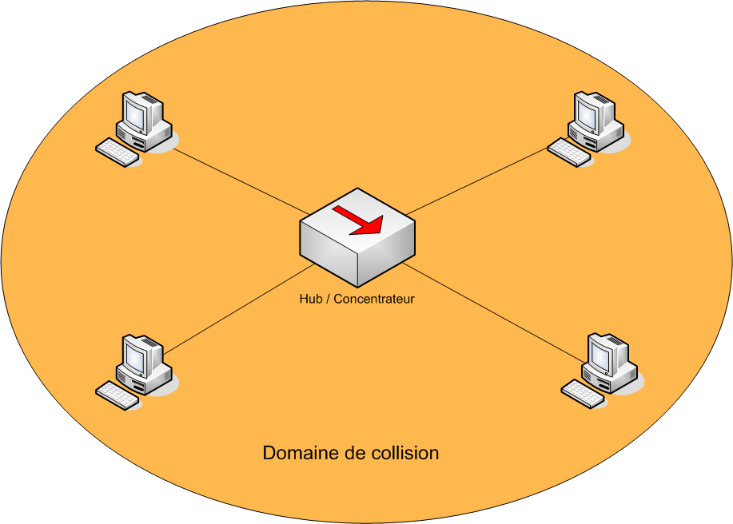
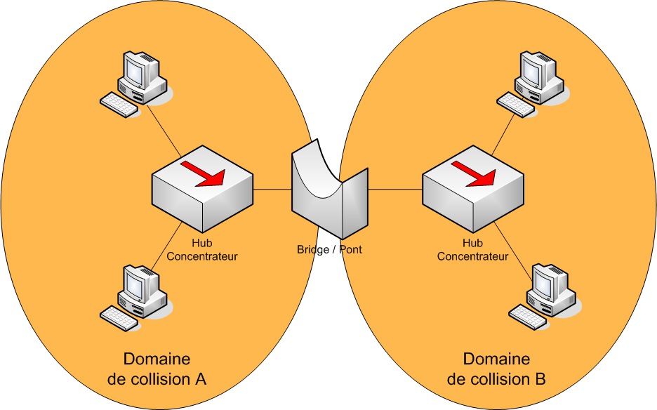
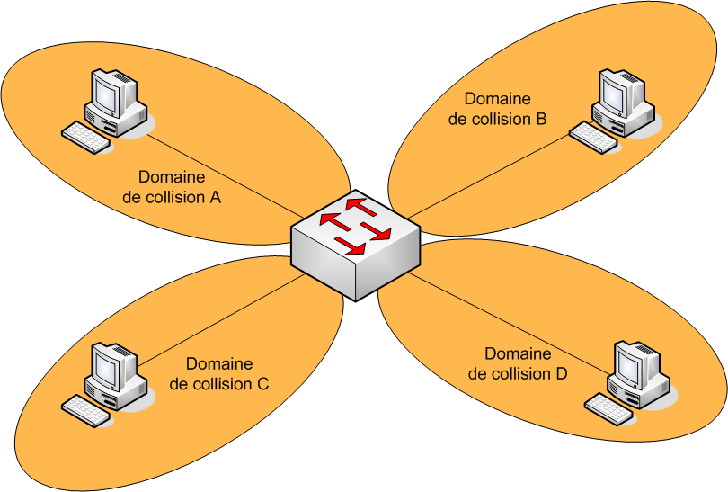
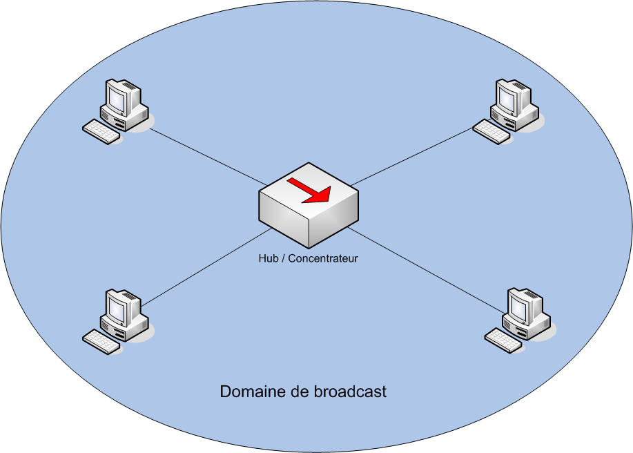
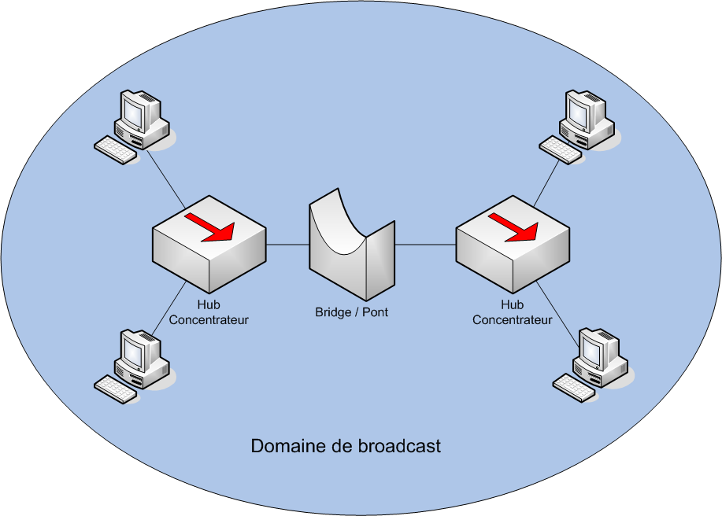
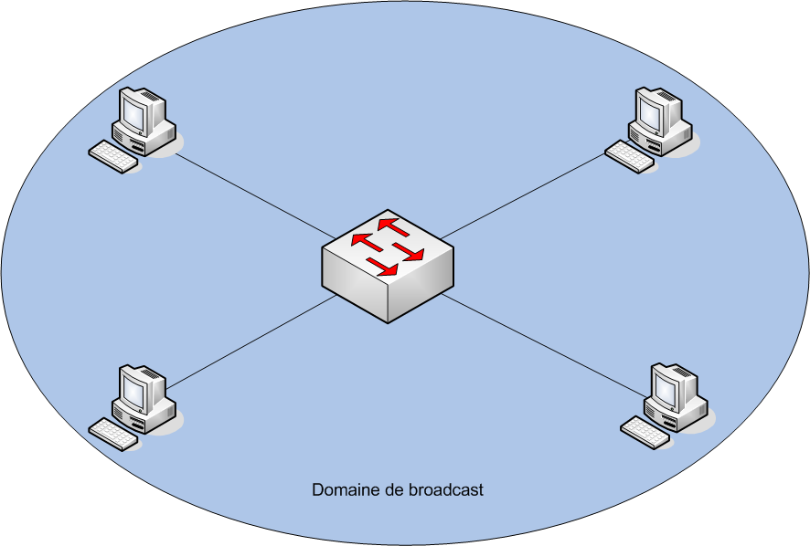
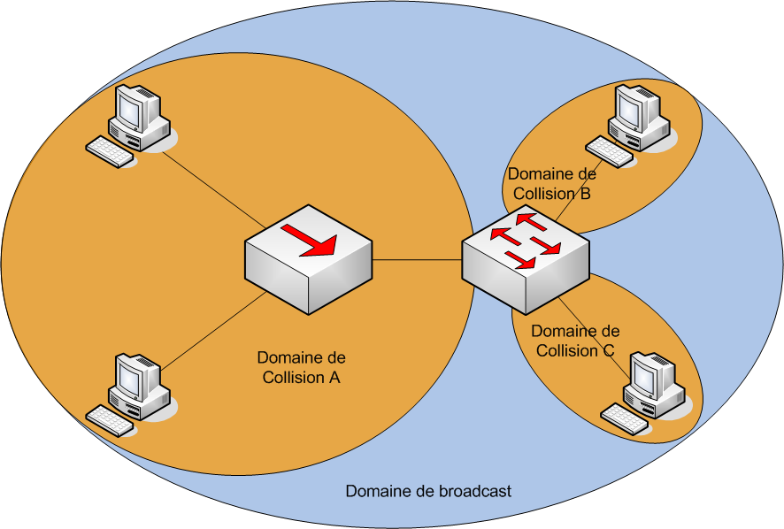
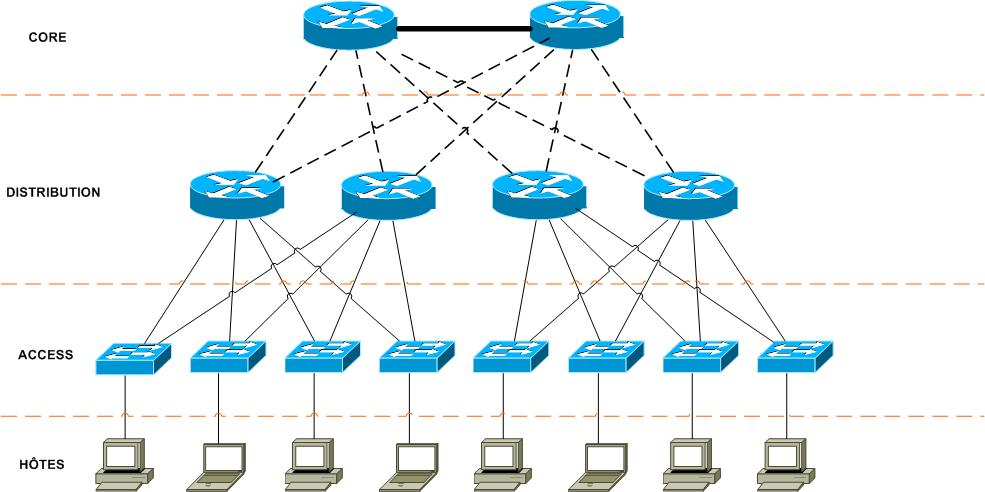

Architecture LAN

Mots clés :

- Commutateur : Switch, pas d'accès à internet (réservé aux Routeurs)
- Domaine de diffusion : Correspond à une interface du routeur, qui ne relai pas les messages de diffusion. Tout ce qui est dans un domaine reçoit les domaines de diffusion
- Réseau local : Réseau LAN, infrastructure réseau couvrant une zone peu étendue. Souvent administré par une seule entreprise ou personne
- Architecture en 3 couches : AKA "tree-layers hierarchical internetworking design/model", les 3 couches sont Couche **Coeur**, Couche **Distribution**, et Couche **Accès**
- Trafic inutile
- Données liées à l'administration : Mots de passe, noms d'utilisateur etc..
- Données en clair : Données non cryptées (utilisation de TelNet par exemple)
- Plage IP : 192.168.25.1 -- 192.168.25.35 (par ex)
- Adresse d'administration : 
- Traitement heuristique : Traitement rapide et intuitif

Contexte :

Quoi ?

- Architecture LAN
- Administration des commutateurs

Comment ?

- En analysant le trafic du réseau
- Faire des maquettes
- Reconfigurant les switches
- Découper les plages IP

Pourquoi ?

- Diffusion trop importante des trames
- Les données passent en clair
- Même plage IP

Problématique :

- Comment réduire le trafic sur un réseau LAN ?

- Comment découper une LAN et traité les données de manière sécurisée ?

Généralisation :

- Reconception

Hypothèse :

- Créer des sous-réseaux
- Réaliser un schéma d'adressage
- Analyser le trafic
- Reconfigurer les switches
- Tempête de broadcast
- Redondance
- Créer des groupes de diffusions

Plan d'action :

Etudes :

- Domaine de diffusion, domaine de collision
	Deux périphériques sont dans le même domaine de collision lorsque l'envoi de données simultané sur la même voix provoque une corruption de ces données.  
	Exemples de domaines de collision :  

	 * Domaine de collision avec un Hub/Concentrateur
	 

	 * Domaine de collision avec un Bridge
	 

	 * Domaine de collision avec un Switch
	 

	Le domaine de diffusion est lui délimité par le type d'équipement présent dans le réseau :
	 * Avec un **Hub**, les messages de diffusion sont transmis car il ne lit pas la couche de niveau 2
	 * Avec un **Brigde**, les messages de diffusion sont transmis car il lit la couche 2 et l'adresse MAC de destination est "ffff.ffff.ffff"
	 * Avec un **Switch**, les messages de diffusion sont transmis car il lit la couche 2 et l'adresse MAC de destination est "ffff.ffff.ffff"
	 * Avec un **Routeur**, les messages de diffusion ne sont pas transmis car il lit la couche de niveau 3 et ne relai pas les messages de broadcast

	Exemples de domaines de diffusion avec Hub, Bridge et Switch :
	 * Hub
	 

	 * Bridge
	 

	 * Switch
	 

	**Exemples de domaines de diffusion et de collision :**
	 * Diffusion et Collision via Hub et Switch
	 

	 * Diffusion et Collision avec un **routeur**
	 

- Séparer les sous-réseaux
	Consiste en découper 'virtuellement' un switch en deux switchs logiques.  
	Il existe trois principales solutions pour définir l'apartenance à un VLAN :
	 * On crée le VLAN sur le switch puis on l'attribue sur les ports souhaités.
	 * On configure le switch pour qu'il récupère l'adresse MAC, il l'envoie à un VMPS (VLAN Membership^Policy Server) qui fait le lien entre VLAN et adresse MAC. Le problème est que si le VMPS tombe en panne, tout le réseau est indisponible.
	 * On utilise la première solution pour les VLAN des PC et le protocole CDP (Cisco Discovery Protocol) pour les téléphones voix sur IP.

	Remarques :
	 * Le VLAN 1 est créé par défaut et tous les ports du switch y appartiennent
	 * On peut donner un nom à un VLAN (optionnel)

	Des plages de VLAN existent et certaines sont réservées :
	  * 0 & 4095 : Réservé pour le système, non utilisable
	  * 1 : VLAN par défaut
	  * 2 - 1001 : VLAN Ethernet
	  * 1002 - 1005 : VLAN créés par défaut pour les technologies FDDI (Fiber Distributed Data Interface) et Token Ring
	  * 1006 - 4094 : VLAN Eternet, plage étendue  

	Configuration :  
	Switch# configure terminal  
	Switch(config)# *vlan* **2**  
	Switch(config)# *name* Administration  
	Switch(config)# end

	Attribution du port à un VLAN :  
	Switch# configure terminal  
	Switch(config)# *interface fastethernet* **0/1**  
	Switch(config-if)# *switchport access* **vlan2**  
	Switch(config-if)# end  
	Switch# show vlan

	Mode Access :

	Mode Trunks :

- Architecture 3 couches
	1. Couche Coeur (Core Layer)
	Couche supérieure, permet de relier les différents segments du réseau : LAN, sites distants, Etage d'une Société, etc.  
	Ce niveau est généralement constitué de routeurs. Beaucoup de débit engendré, nécessitant des équipements ayant des performances importantes
	2. Couche Distribution (Distribution Layer)
	On s'y interesse après les couche coeur. Son rôle est simple, filtrer, router et autoriser ou non les paquets. Ici on divise le réseau en segments avec plusieurs routeurs/switchs, connectés d'un coté à la couche Coeur et de l'autre à la couche Accès.  
	On devra ici choisir entre Switch (VLAN) et Routeur, pour une petite entreprise des switchs suffisent.  
	Ces routeurs/switchs vont permettres d'assurer la tolérance aux pannes, de délimiter les zones de broadcast etc.  
	3. Couche Accès (Access Layer)
	Son rôle est de connecter les périphériques "end" au réseau. Ici uniquements des switchs (ou des hubs), puisque tous le travail des switchs à déjà été effectué. On ne s'occupe ici que de la connexion des hôtes, en Ethernet, Wi-Fi ou autre. Et on le fait de maniere sécurisée, en désactivant les ports non utilisés, via switchport, etc. Pour cette couche, des switchs basiques suffisent, ils n'auront à gérer que le trafic généré par leurs interfaces.  

	Modèle 3 couches
	

	Conclusion :  
	 * Ce modèle hiérarchique est une référence, il est très utilisé. Mais il faut bien entendu l’adapter aux besoins de son entreprise.  
	 * Chaque couche – Core / Distribution / Access – implique des configurations différentes. Notamment la couche Access, qui nécessite de la part de l’administrateur certaines actions (réglage de l’état de chaque port des switchs, mise en place de trunk, sécurité, etc…)

	 * Tous les liens (lien = liaison entre deux points, englobant le côté physique et logiciel) sont doublés/backupés dans la majorité des cas. (voire mon article précédent par exemple)

- VLSM

- Configurer les switches de façon sécurisée (VTP, port)

- VLAN

Réaliser :

- Proposer une architecture adaptée

