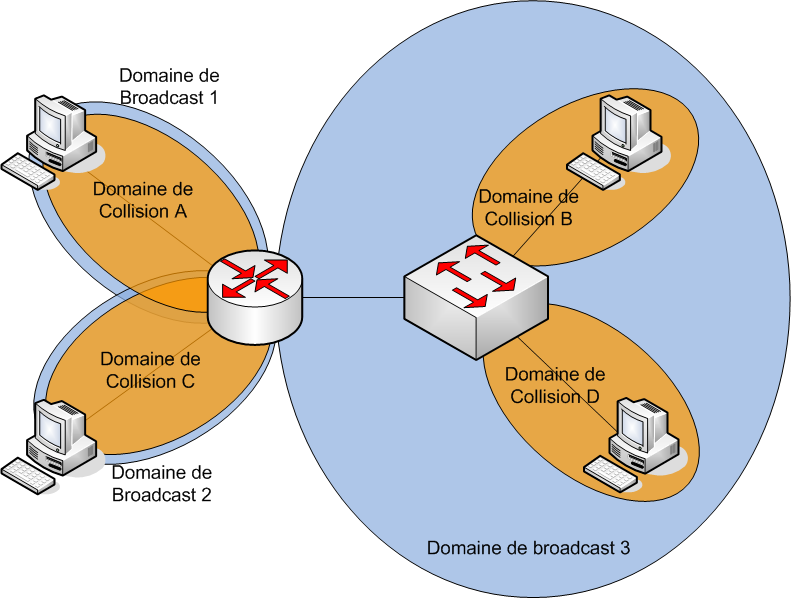

Architecture LAN

Mots clés :

- Commutateur : Switch, pas d'accès à internet (réservé aux Routeurs)
- Domaine de diffusion : Correspond à une interface du routeur, qui ne relai pas les messages de diffusion. Tout ce qui est dans un domaine reçoit les domaines de diffusion
- Réseau local : Réseau LAN, infrastructure réseau couvrant une zone peu étendue. Souvent administré par une seule entreprise ou personne
- Architecture en 3 couches : AKA "tree-layers hierarchical internetworking design/model", les 3 couches sont Couche **Coeur**, Couche **Distribution**, et Couche **Accès**
- Trafic inutile
- Données liées à l'administration : Mots de passe, noms d'utilisateur etc..
- Données en clair : Données non cryptées (utilisation de TelNet par exemple)
- Plage IP : 192.168.25.1 -- 192.168.25.35 (par ex)
- Adresse d'administration : 
- Traitement heuristique : Traitement rapide et intuitif

Contexte :

Quoi ?

- Architecture LAN
- Administration des commutateurs

Comment ?

- En analysant le trafic du réseau
- Faire des maquettes
- Reconfigurant les switches
- Découper les plages IP

Pourquoi ?

- Diffusion trop importante des trames
- Les données passent en clair
- Même plage IP

Problématique :

- Comment réduire le trafic sur un réseau LAN ?

- Comment découper une LAN et traité les données de manière sécurisée ?

Généralisation :

- Reconception

Hypothèse :

- Créer des sous-réseaux
- Réaliser un schéma d'adressage
- Analyser le trafic
- Reconfigurer les switches
- Tempête de broadcast
- Redondance
- Créer des groupes de diffusions

Plan d'action :

Etudes :

- Domaine de diffusion, domaine de collision
	Deux périphériques sont dans le même domaine de collision lorsque l'envoi de données simultané sur la même voix provoque une corruption de ces données.  
	Exemples de domaines de collision :  

	 * Domaine de collision avec un Hub/Concentrateur
	 

	 * Domaine de collision avec un Bridge
	 

	 * Domaine de collision avec un Switch
	 

	Le domaine de diffusion est lui délimité par le type d'équipement présent dans le réseau :
	 * Avec un **Hub**, les messages de diffusion sont transmis car il ne lit pas la couche de niveau 2
	 * Avec un **Brigde**, les messages de diffusion sont transmis car il lit la couche 2 et l'adresse MAC de destination est "ffff.ffff.ffff"
	 * Avec un **Switch**, les messages de diffusion sont transmis car il lit la couche 2 et l'adresse MAC de destination est "ffff.ffff.ffff"
	 * Avec un **Routeur**, les messages de diffusion ne sont pas transmis car il lit la couche de niveau 3 et ne relai pas les messages de broadcast

	Exemples de domaines de diffusion avec Hub, Bridge et Switch :
	 * Hub
	 

	 * Bridge
	 

	 * Switch
	 

	**Exemples de domaines de diffusion et de collision :**
	 * Diffusion et Collision via Hub et Switch
	 

	 * Diffusion et Collision avec un **routeur**
	 

- Séparer les sous-réseaux

- Architecture 3 couches

- VLSM

- Configurer les switches de façon sécurisée (VTP, port)

- VLAN

Réaliser :

- Proposer une architecture adaptée

